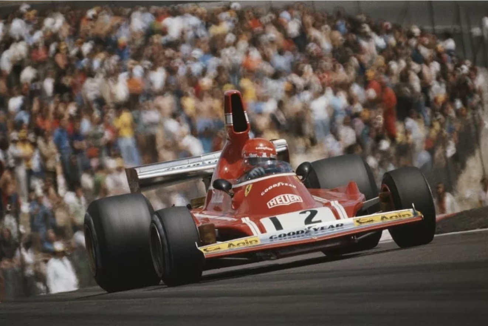
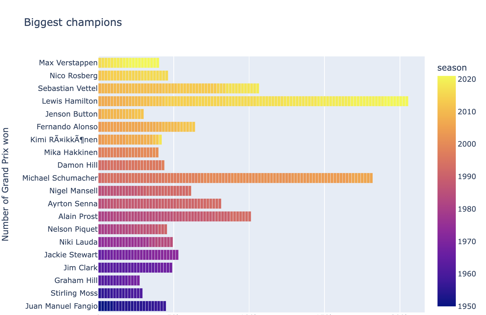
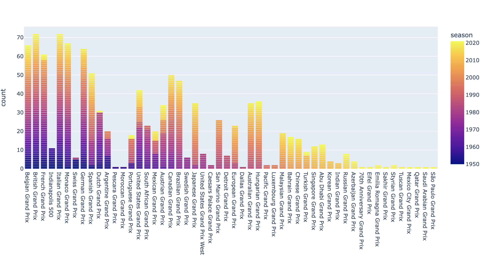
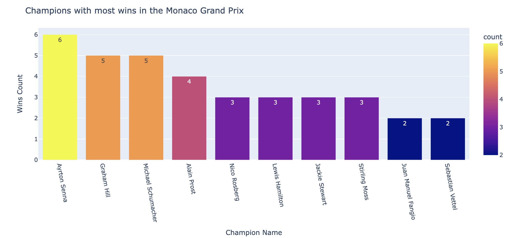
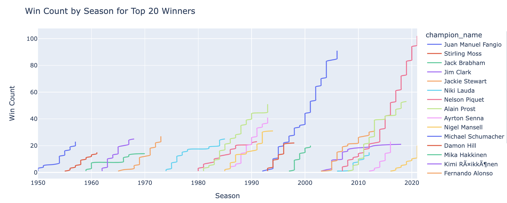
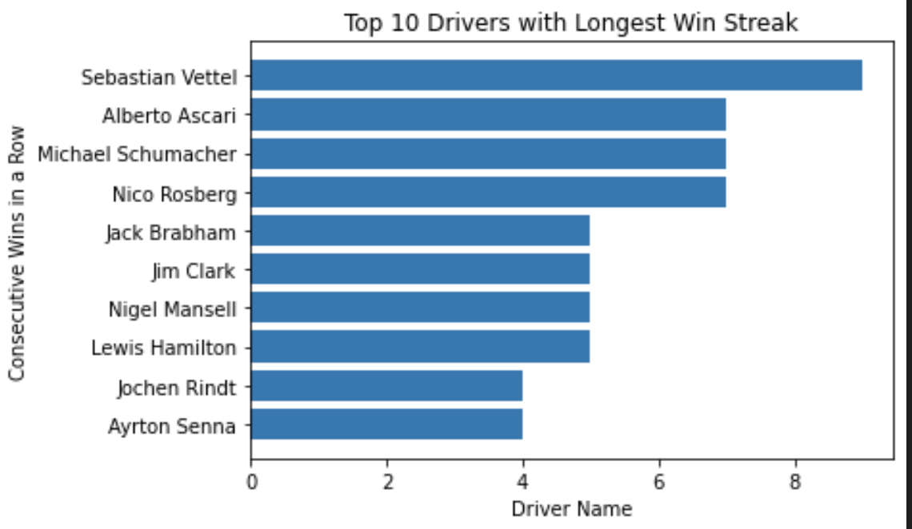
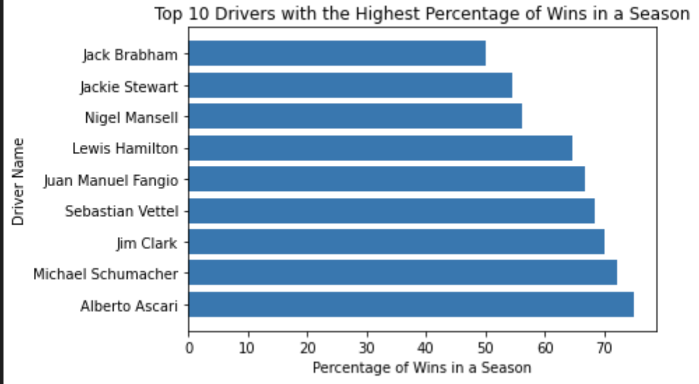

# F1 Project Santiago Aguilar

# Introduction

This project is a demonstration of the potential of web scraping as a tool for data enrichment. The project utilizes data extracted from an API and data obtained from web scraping to analyze the performance of drivers in the Formula 1 racing series.

The motivation for the project is that APIs often provide limited data, which can be complemented by data obtained through web scraping. This project shows the process of collecting and integrating data from both sources to create a comprehensive and robust dataset.

Overall, this project serves as an example of the value of data integration and the power of web scraping as a tool for data enrichment.

# Extractinng & cleaning 

## 1. API
The first step in this process involved extracting data from the API. The API extractor file contains the function used to gather all relevant information regarding circuits and race dates, covering all Formula One races since the beginning of the sport until 2021.

## 2. Web Scraping
Secondly, the web scraping aspect of the project was a difficult process, as the official Formula One website only displays information for one season at the time. Every single season with its corresponding date and driver name was obtained through web scraping.  On the site_scrapper file there are six functions relating to how this was done. From changing dates to the api's format, to finding the name and surname of the driver for each race. It also shows how for every different year a new web scrape was done to find all the relevant data. After that, all data from different seasons is merged to create one file. All of these functions are merged into one called process_championship to make it easier to use. 

## 3. Merging Datasets
In the third step, the merger4_api_scrapper file takes both the API and webscraped datasets and merges them into a single dataset. The key to this process is using the date of the races as a reference point to set the race winners to their won races. By doing so, we are able to combine the circuit and date information from the API with the winning driver information from the webscraping.

## 4. Cleaning up
In the final stage of the extracting and cleaning stage, the functions created in the previous steps are utilized in the project.ipynb notebook to obtain the full dataset. After the dataset is full and clean it is exported as clean.csv for further analysis.

# Visualisation

The next step in the project is to utilize the newly acquired, clean and organized dataset to gain valuable insights through data visualization and analysis.The visualizations will help to effectively communicate the findings and highlight patterns, trends and anomalies that may not have been easily noticeable in the raw data. Additionally, the analysis will assist in answering questions and uncovering new questions to be explored further. This is an essential step in making the most out of the data and understanding the data as a whole.

## - Top Drivers
To start, a bar chart was created to showcase the drivers with the most wins. This chart provides a clear representation of the top drivers in terms of number of wins and highlights their dominance in the sport. 

## - Famous Racetracks
The next chart that was created is a bar chart to visualize the most popular racetracks throughout time. This helps to get a better understanding of the history of Formula 1 racing and where the majority of races have been held.

## - Most Monaco wins
Additionally, this project also wanted to find out which drivers have the most wins in the iconic Monaco Grand Prix, one of the most famous and prestigious races in the F1 calendar. This analysis provides insights into the performance of different drivers in this historic race.

## - Wins through out history
Moreover, the study also shows a line chart that represents the wins of each driver through time, this chart makes the visualization of the rivalries of each time period clear and gives information about the most prominent drivers in that time. 

## - Longest winning streak
Furthermore, the longest winning streaks are looked at, for this a new function is created that will add a column to the dataframe and let us explore the drivers with most consecutive wins.

## - Most wins ratio in one Seasonn
Laslty, the study wanted to explore the most wins for each driver in a single season. As this research was ongoing, it was realized that the number of races per season has been going up since the beginning of F1 so the approach had to be changed. Instead the study looked at the  percentage of most wins by a single driver in a season. 

# Conclusion
In conclusion, this project demonstrates the potential of web scraping and data integration in data analysis. The project combines data from an API and web scraping to analyze the performance of Formula 1 drivers. The data includes information on races, drivers, and performance, with a focus on wins and circuits. The project also showcases the use of data manipulation and visualization techniques to gain insights and create meaningful visualizations.

Thank you!!